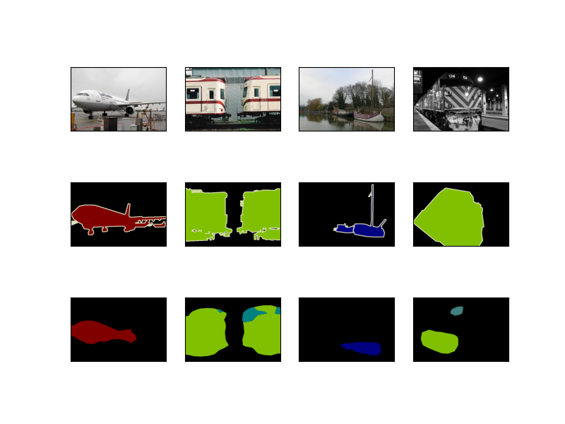
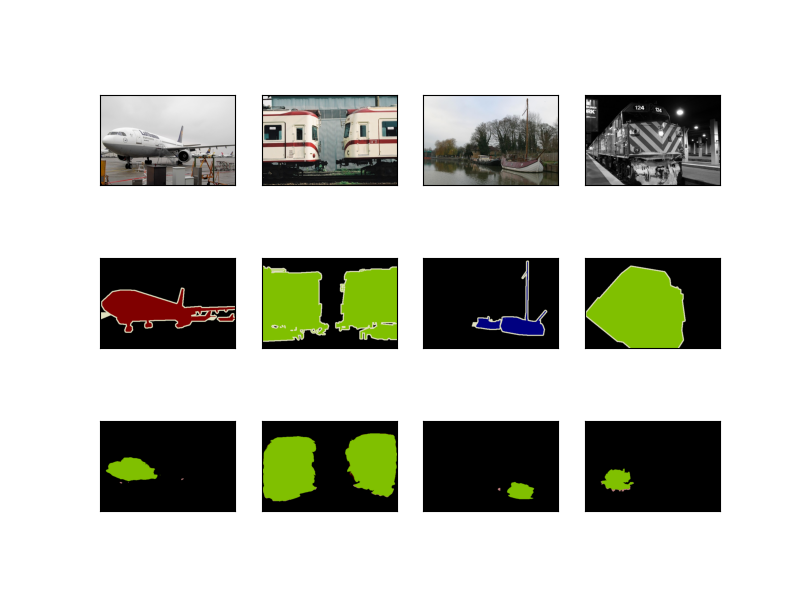
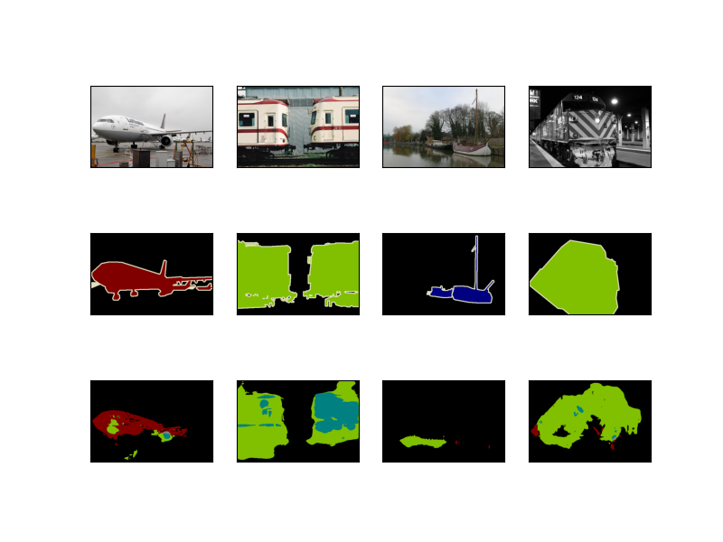
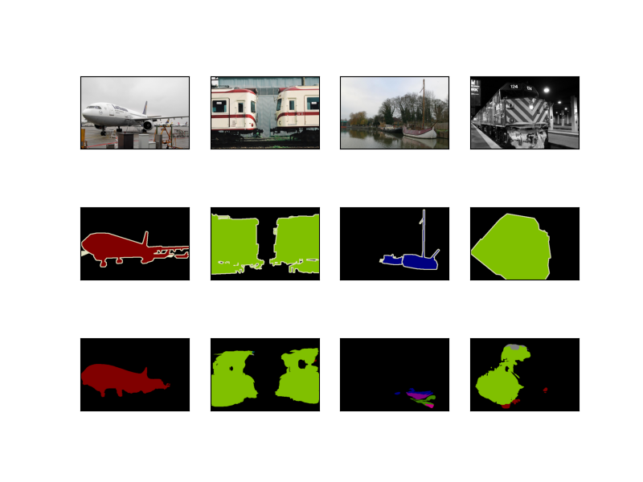
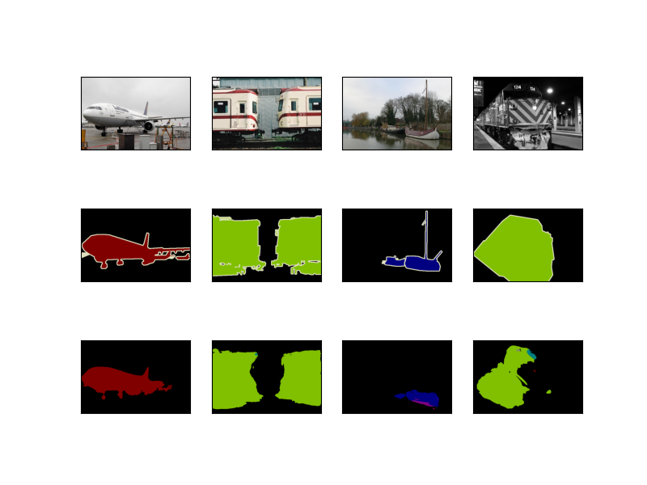

# d2l-pytorch-FCN-small-improvements的介绍

"d2l" - "dive into deep learning" - "动手学深度学习"

## 对于 d2l中 “用FCN实现语义分割” 相关内容的一点改进
语义分割是对图像中的每个像素分类。
_全卷积网络_（fully convolutional network，_FCN_）采用卷积神经网络实现了从图像像素到像素类别的变换。

《动手学深度学习》： https://github.com/d2l-ai/d2l-zh

我学习使用的代码是从 https://D2L.ai 下载到的jupyter notebook（pytorch版），参考了李沐老师在bilibili的视频资源。

## 1.仓库主要文件
```
   ─some_define.py 
   ─origin_train.py 
   ─origin_predict.py
   ─
   ─my_train.py
   ─my_predict.py
   ─net_30_lowlr10.pth (70MB)
   ─
   ─VOC2012/
   ├── ImageSets/
   │   ├── Segmentation/
   │       ├── train.txt
   │       └── val.txt
   ├── JPEGImages/*.jpg
   │
   ├── SegmentationClass/*.png

```
---

【注1】VOC2012这个目录我没有上传，需要去下载数据集

http://host.robots.ox.ac.uk/pascal/VOC/voc2012/#data ->"Development Kit"-> "Download the training/validation data (2GB tar file)" ，

你会得到“VOCtrainval_11-May-2012.tar”，解压到当前的目录，然后设置目录名及目录结构和我上图一致。

【注2】resnet18-f37072fd.pth同样也需要下载

https://download.pytorch.org/models/resnet18-f37072fd.pth

---
1.1
* some_define.py 
* origin_train.py 
* origin_predict.py

上述.py 是将 d2l pytorch版 jupyter notebook代码重构的结果（源码是位于chapter_computer-vision章节里的三个.ipynb文件，
三者分别是semantic-segmentation-and-dataset.ipynb、transposed-conv.ipynb、
fcn.ipynb）综合jupyter notebook源码，把参数、相关函数、相关类的定义集中在some_define.py中，
封装训练相关内容于origin_train.py，封装推理相关内容于origin_predict.py。


1.2
* my_train.py
* my_predict.py
* net_30_lowlr10.pth


## 2.改进部分
### 2.1 改变网络模型、使用Adam优化器、调整学习率

有所改进的my_train.py，主要是，实例化了一个ResNetUNet类。这个类定义在some_define.py

#### 共3处改进：

---

* 改进前origin_train.py（源码）使用的网络：resnet18卷积层部分 + 一层1×1卷积 + 一层转置卷积
```
net = nn.Sequential(*list(resnet18.children())[:-2])
net.add_module('final_conv', nn.Conv2d(512, 21, kernel_size=1))
net.add_module('transpose_conv', nn.ConvTranspose2d(21, 21, kernel_size=64, padding=16, stride=32))
```

现在，

my_train.py使用ResNetUNet：基础网络仍然是resnet18，只是拿出基础网络的一些层去构建成U-net结构。
要构建的ResNetUNet的 layer0 是 resnet18[:3]，layer1 是 resnet18[3:5]，... ，layer4 是 resnet18[7]，
关于使用layer0~layer4去进行“U”型的连接细节，可见some_define.py中 ResNetUNet类的forward定义。

---

* 改进前origin_train.py（源码）使用的优化器：torch.optim.SGD

现在，

my_train.py使用torch.optim.Adam

---

* 改进前origin_train.py（源码）的学习率：1e-3

现在，

my_train.py使用lr=1e-4

---

*消融实验1* 

若my_train.py仅仅只是改变网络结构，而仍然使用SGD优化器、1e-3的学习率，均30轮训练：

左图是./pictures/origin_out.png, 

右图是只改变网络结构的./pictures/out_only_change_net.png
<table>
  <tr>
    <td></td>
    <td></td>
  </tr>
</table>

*消融实验2*

若my_train.py使用 ResNetUNet + Adam，而仍然使用1e-3的学习率，均30轮训练：

左图依然是./pictures/origin_out.png, 

右图是./pictures/out_ResNetUNet_Adam.png
<table>
  <tr>
    <td></td>
    <td></td>
  </tr>
</table>

#### 综合3处改进的推理结果会稍好一些
左图依然是./pictures/origin_out.png, 

右图为改进结果./pictures/myout.png(ResNetUNet + Adam + 1e-4)，均30轮训练
<table>
  <tr>
    <td></td>
    <td></td>
  </tr>
</table>

*continue*

如果在ResNetUNet + Adam + 1e-4 训练了30轮的基础上，再去以lr=1e-5继续训练10轮，会看到更好的效果：

左图放的是上面综合3处改进的推理结果，即./pictures/myout.png (ResNetUNet + Adam + 30轮1e-4），

右图./pictures/out_30_lowlr10.png（ResNetUNet + Adam + 30轮1e-4 + 10轮1e-5）
<table>
  <tr>
    <td></td>
    <td></td>
  </tr>
</table>

#### 后续，我就没有继续改进下去，告一段落了。

net_30_lowlr10.pth也是我“ResNetUNet + Adam + 30轮1e-4 + 10轮1e-5”的结果。

my_predict.py就是加载的这个.pth。


#### * 所付出的代价： 
1. 替换模型后，相同的条件下，需要更多的训练时间：不得不减少batch_size！梯度更新可能不稳定（由于每次迭代处理的样本数量较少，梯度估计可能会不准确）

我的本地笔记本使用GPU（8 GB）去训练，无法使用源码中的默认batch_size=32，本地笔记本只能将batch_size调整为了8。
所以 2.1 里面做改进，均是另一台设备训练，然后由本地笔记本推理得到结果图。

### 2.2 改变？？？
#### ？处改进

后续更新。。。
